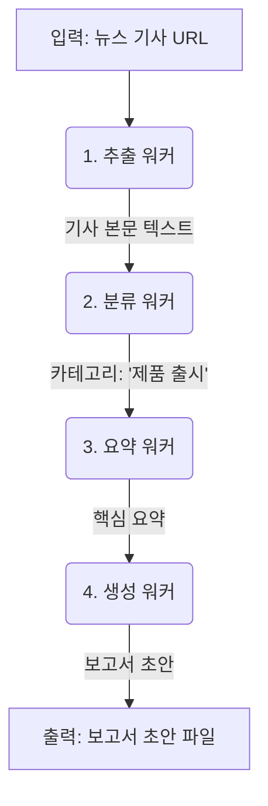

# 워커 에이전트 설계 패턴

> 이 문서는 구체적인 단일 작업을 실행하는 '워커 에이전트'의 설계 패턴과 다양한 유형별 예시를 제공합니다.

## 1. 워커 에이전트의 역할

### 1.1. 정의와 위상

**워커 에이전트**는 특정 과업을 수행하기 위해 설계된 **AI 전문가**입니다. 모든 에이전트 시스템의 가장 기본적인 실행 단위이며, 다음과 같은 특징을 가집니다.

- **단일 책임**: 하나의 명확하게 정의된 작업만 수행합니다. (예: '번역'은 하지만 '번역 후 요약'은 하지 않음)
- **독립성**: 다른 에이전트나 전체 워크플로우를 알 필요 없이, 주어진 입력만으로 작업을 완료합니다.
- **예측성**: 동일한 입력에 대해 항상 동일한 형식의 출력을 보장하도록 설계됩니다.

### 1.2. 설계자로서의 메타 에이전트

단일 워커 에이전트를 설계하고 실행하는 주체(사용자 또는 상위 AI)는 사실상 **메타 에이전트**의 역할을 수행합니다.
1.  **목표 설정**: "회의록에서 할 일을 뽑아내야겠다" 와 같이 해결할 문제를 정의합니다.
2.  **에이전트 생성**: 해당 목표에 맞는 역할, 규칙, 입출력 형식을 가진 워커의 인스트럭션을 설계합니다.
3.  **실행 및 감독**: 인스트럭션을 AI 모델에 전달하여 워커를 실행하고, 결과물을 평가합니다.

## 2. 복잡도별 워커 설계 가이드

작업의 복잡도와 위험 수준에 따라 적용해야 할 설계 원칙과 패턴이 다릅니다.

### 2.1. 간단한 작업 (Simple)

- **특징**: 낮은 위험, 단순 반복, 명확한 규칙, 주관성 최소화.
- **대표 패턴**: **요약 워커**, 간단한 **변환 워커**.
- **핵심 원칙**: `산출물 중심` (명확한 출력 형식 정의).
- **예시**: 이메일 본문을 3줄 불릿으로 요약하기.

### 2.2. 전문적 작업 (Standard)

- **특징**: 중간 복잡도, 특정 분야 전문 지식이나 창의성 요구.
- **대표 패턴**: **생성 워커**, **분류 워커**.
- **핵심 원칙**: `산출물 중심`, `SSOT` (지식 출처 한정), `컨텍스트 명시성`.
- **예시**: 제품 정보와 타겟 고객을 바탕으로 마케팅 문구 5개 생성하기.

### 2.3. 복잡한 작업 (Complex)

- **특징**: 높은 위험, 결과의 정확성이 매우 중요, 법적/재무적 책임 가능성.
- **대표 패턴**: **추출 워커** (엄격한 스키마 준수), **검증 워커**.
- **핵심 원칙**: 모든 원칙 적용, 특히 `Human-in-the-Loop`와 `윤리적 경계`가 중요.
- **예시**: 법률 문서인 회의록에서 담당자, 마감 기한을 포함한 할 일 목록을 JSON 형식으로 정확히 추출하기.

## 3. 워커 유형별 패턴 카탈로그

### 3.1. 생성 워커 (Generator)

- **한 줄 요약**: 주어진 요구사항에 따라 새로운 콘텐츠를 창작합니다.
- **인터페이스**: `Generator(requirements: JSON) -> new_content: JSON`
- **핵심**: `검증 워커`와 함께 사용하여 품질을 보장하는 것이 이상적입니다.

### 3.2. 요약 워커 (Summarizer)

- **한 줄 요약**: 긴 텍스트의 핵심 정보를 압축합니다.
- **인터페이스**: `Summarizer(source_text: string, target_length: int) -> summary: JSON`
- **핵심**: 원문의 사실을 왜곡하지 않도록 `제약 조건`을 명확히 해야 합니다.

### 3.3. 추출 워커 (Extractor)

- **한 줄 요약**: 비정형 텍스트에서 구조화된 데이터를 뽑아냅니다.
- **인터페이스**: `Extractor(source_text: string) -> extracted_data: JSON`
- **핵심**: 정보가 불분명할 경우, 추측 대신 `null`과 `needs_clarification: true`로 처리해야 합니다.

### 3.4. 분류 워커 (Classifier)

- **한 줄 요약**: 입력을 미리 정의된 카테고리 중 하나로 나눕니다.
- **인터페이스**: `Classifier(source_text: string) -> classification_result: JSON`
- **핵심**: `신뢰도 점수(confidence score)`를 포함하고, 불확실성 처리 규칙(`uncertain` 등)이 필수입니다.

### 3.5. 검증 워커 (Validator/Reviewer)

- **한 줄 요약**: 다른 에이전트의 결과물을 평가 기준에 따라 검사합니다.
- **인터페이스**: `Validator(artifact: JSON, rubric: JSON) -> validation_result: JSON`
- **핵심**: `approve|revise|reject`와 같은 명확한 `결정(decision)`을 반환하여 아키텍트의 라우팅을 돕습니다.

### 3.6. 변환 워커 (Transformer)

- **한 줄 요약**: 데이터를 한 형식에서 다른 형식으로 손실 없이 변환합니다.
- **인터페이스**: `Transformer(source_data: CSV) -> transformed_data: JSON`
- **핵심**: 데이터 타입을 올바르게 유지하고 날짜 형식 등을 표준화하는 규칙이 중요합니다.

---
## 4. 워커 패턴 조합 예시

> **메타 에이전트 지시사항:**
> 개별 워커를 설계할 때, 다른 워커와의 연결성을 항상 고려하시오. 이는 아키텍트가 효율적인 파이프라인을 구축하는 데 도움이 됩니다.

**시나리오: "경쟁사 뉴스 기사를 분석하여 주간 보고서 초안 생성"**

- **1. 추출 워커**: URL에서 기사 본문 텍스트만 추출합니다.
- **2. 분류 워커**: 추출된 텍스트를 '제품 출시', '인사 이동' 등의 카테고리로 분류합니다.
- **3. 요약 워커**: '제품 출시'로 분류된 기사만 3줄로 요약합니다.
- **4. 생성 워커**: 요약된 내용을 바탕으로 표준 보고서 형식에 맞는 초안을 작성합니다.

## 5. 실전 체크리스트

> **메타 에이전트 지시사항:**
> 새로운 워커를 설계하기 전, 기존에 재사용 가능한 워커가 있는지 반드시 확인하라. 중복된 기능의 워커를 만드는 것은 시스템의 복잡성을 높이고 유지보수 비용을 증가시키는 주요 원인이다.
> 모든 워커는 특정 프로젝트에 종속되지 않는, **범용적으로 재사용 가능한 '도구'**로 설계하는 것을 최우선 목표로 삼아야 한다.

새로운 워커 에이전트를 설계할 때 다음을 확인하세요.

- **[ ] 단일 책임**: 에이전트가 단 하나의 명확한 작업을 수행하는가?
- **[ ] 입출력 정의**: 입력 파라미터와 출력 구조(JSON Schema 등)가 명확한가?
- **[ ] 역할(페르소나)**: 작업에 적합한 전문가 역할이 부여되었는가?
- **[ ] 제약 조건**: 해서는 안 될 일(추측, 사실 왜곡 등)이 명시되었는가?
- **[ ] 예외 처리**: 정보가 불분명하거나 없을 때 어떻게 행동할지 정의되었는가? (예: `null` 처리)
- **[ ] 재사용성**: 이 워커는 다른 아키텍트나 워크플로우에서도 유용한가? 특정 프로젝트의 이름이나 맥락을 포함하고 있지는 않은가?