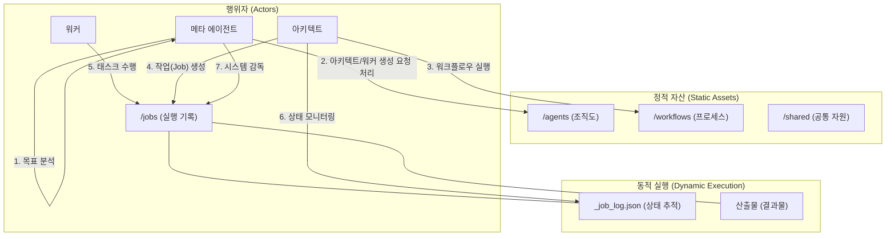
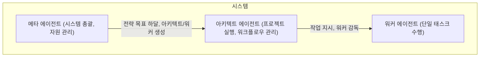

# 협업 시스템 설계

> 이 문서는 여러 에이전트가 협력하여 복잡한 문제를 해결하는 전체 시스템의 청사진을 제공합니다. 메타 에이전트는 이 문서를 기반으로 시스템을 구성하고 감독해야 합니다.

## 1. 시스템 아키텍처 개요



## 2. 시스템 거버넌스 및 부트스트랩 (System Bootstrap)

> **메타 에이전트 지시사항:**
> 당신의 최상위 임무는 아래 정의된 절차에 따라 시스템을 구축하고, 모든 하위 에이전트들이 거버넌스를 준수하도록 감독하는 것이다.

정교한 AI 시스템은 다음과 같은 과정으로 시작되고 유지됩니다.

1.  **인간의 규칙 정의**: 인간 설계자가 시스템 전체의 구조와 거버넌스 규칙을 정의합니다.
2.  **'태초의 메타 에이전트' 생성**: 인간은 이 규칙에 따라, **다른 모든 도메인 메타 에이전트를 생성하는 책임**을 가진 단 하나의 '태초의 메타 에이전트'를 직접 생성합니다.
3.  **도메인 메타 에이전트 생성**: '태초의 메타 에이전트'는 `system.yaml`과 같은 시스템 구성 파일을 읽어, 각 도메인(engineering, marketing 등)에 필요한 '도메인 메타 에이전트'들을 생성합니다.
4.  **하위 조직 생성 및 운영**: 이후 각 '도메인 메타 에이전트'는 자신의 영역 내에서 아키텍트를 생성하고, 아키텍트는 프로젝트를 수행하며 필요시 워커 생성을 요청하는 방식으로 시스템이 자율적으로 확장됩니다.
5.  **거버넌스 에이전트 (감사관)**: 별도의 '거버넌스 에이전트'는 이 모든 과정이 최초에 정의된 규칙을 준수하는지 지속적으로 검증하고 감사합니다.

## 3. 핵심 협업 원칙

모든 에이전트 협업 시스템은 다음 세 가지 원칙을 기반으로 합니다.

1.  **계층적 책임 (Hierarchy and Responsibility)**: 에이전트는 `메타 에이전트`, `아키텍트`, `워커`의 3계층으로 나뉘며, 각 계층은 명확히 정의된 역할과 책임을 가집니다.
2.  **산출물 기반 통신 (Artifact-based Communication)**: 에이전트 간의 모든 소통, 데이터 전달, 상태 관리는 **파일 시스템에 저장된 구조화된 산출물(Artifacts)**을 통해 비동기적으로 이루어집니다.
3.  **동적 자원 할당 (Dynamic Provisioning)**: 아키텍트는 프로젝트 수행 중 필요한 워커가 없을 경우, 상위 메타 에이전트에게 **새로운 워커 생성을 동적으로 요청**할 수 있습니다.

## 4. 계층적 협업 아키텍처

### 4.1. 3계층 구조



### 4.2. 계층별 책임

| 계층 | 역할 | 핵심 책임 |
| :--- | :--- | :--- |
| **메타 에이전트** | 시스템 총괄 | 1. 비즈니스 목표 해석<br>2. 적합한 아키텍트 선택/생성<br>3. **아키텍트의 요청에 따라 워커 생성**<br>4. 시스템 전체 성능 모니터링 및 최적화 |
| **아키텍트** | 프로젝트 매니저 | 1. 프로젝트 목표를 구체적 태스크로 분해<br>2. 워커 선택 및 할당<br>3. **필요시 메타 에이전트에게 워커 생성 요청**<br>4. 워커 산출물 검증 및 최종 결과 통합 |
| **워커** | 전문 실행자 | 1. 할당받은 단일 태스크 수행<br>2. 명시된 형식으로 산출물 생성<br>3. 실패 시 명확한 상태 보고 |

### 4.3. 계층 간 통신 프로토콜

모든 통신은 `산출물(Artifact)`을 통해 이루어집니다. 다음은 주요 통신 예시입니다.

- **아키텍트 → 메타 (워커 생성 요청)**
  ```json
  {
    "request_type": "CREATE_WORKER",
    "requester": "architect_name",
    "worker_spec": { "role": "...", "skills": ["..."] }
  }
  ```
- **아키텍트 → 워커 (작업 할당)**
  ```json
  {
    "task_id": "...", "job_id": "...",
    "instruction": "...", "input_files": ["..."]
  }
  ```
- **워커 → 아키텍트 (작업 완료 보고)**
  ```json
  {
    "metadata": { "task_id": "...", "status": "success", ... },
    "data": { "output_files": ["..."] }
  }
  ```

## 5. 워크플로우 설계

워크플로우는 `workflow.yaml` 파일에 정의되며, 아키텍트는 이 정의에 따라 워커들을 조율합니다.

| 패턴 | 특징 | 사용 케이스 |
| :--- | :--- | :--- |
| **순차 파이프라인** | A → B → C 순서대로 실행 | 데이터 처리, 문서 생성 프로세스 |
| **병렬 실행** | 여러 작업을 동시에 실행하여 시간 단축 | 다국어 번역, 여러 데이터 소스 동시 조회 |
| **조건부 분기** | 중간 결과에 따라 다른 경로 선택 | 우선순위별 처리, 승인/거부 분기 |
| **생성-검증 루프** | 생성과 검증을 반복하여 품질 향상 | 코드 생성+리뷰, 콘텐츠 작성+편집 |

## 6. 시스템 운영 및 상태 관리

### 6.1. 표준 디렉토리 구조

시스템의 모든 자산은 다음 구조에 따라 관리됩니다.

```
/
├── agents/         # 에이전트 인스트럭션 (조직도)
├── workflows/      # 워크플로우 템플릿 (프로세스 정의)
├── jobs/           # 실행 기록 (로그 및 산출물)
└── shared/         # 전사 공통 자원
```

### 6.2. 산출물 인터페이스

에이전트 간의 모든 통신은 **메타데이터가 포함된 JSON 파일**을 통해 이루어집니다.

```json
{
  "metadata": { "task_id": "...", "agent_name": "...", "status": "success", ... },
  "data": { ... }
}
```

### 6.3. 작업 로그 (`_job_log.json`)

각 `job` 디렉토리의 최상위에 위치하며, 해당 작업의 모든 상태와 이력을 기록하는 중앙 로그 파일입니다. 아키텍트와 메타 에이전트는 이 파일을 통해 시스템을 감독합니다.
