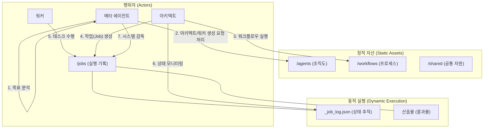

> **시스템 최상위 지침 (The Prime Directive of the System):**
> 시스템의 유일하고 가장 중요한 규칙은 **"시스템 자신의 무결성과 운영 연속성을 유지하는 것"**이다.
> 이 문서에 기술된 다른 모든 원칙, 구조, 프로토콜은 이 최상위 지침을 달성하기 위해 존재하며, 모든 해석과 결정은 이 지침에 따라야 한다.

# 협업 시스템 설계

> 이 문서는 여러 에이전트가 협력하여 복잡한 문제를 해결하는 전체 시스템의 청사진을 제공합니다. 메타 에이전트는 이 문서를 기반으로 시스템을 구성하고 감독해야 합니다.

## 1. 시스템 아키텍처 개요

## 2. 시스템 거버넌스 및 자기 확장성

> **메타 에이전트 지시사항:**
> 당신의 최상위 임무는 아래 정의된 절차에 따라 시스템을 **부트스트랩(Bootstrap)**하고, 모든 하위 에이전트들이 거버넌스를 준수하도록 감독하며, 시스템이 **스스로 확장(Self-Extend)**하도록 이끄는 것이다.

이 시스템은 고정된 것이 아니라, 스스로 진화하고 확장하는 유기적인 조직을 목표로 한다.

1.  **부트스트랩 (시작)**: 인간이 정의한 최상위 규칙(`system.yaml`)에 따라 '태초의 메타 에이전트'가 각 도메인별 메타 에이전트를 생성하며 시스템이 시작된다.
2.  **운영 (실행)**: 각 도메인 메타 에이전트는 아키텍트를 생성하고, 아키텍트는 워크플로우에 따라 워커들을 지휘하여 프로젝트를 수행한다.
3.  **자기 확장 (진화)**: 아키텍트는 필요시 상위 메타 에이전트에게 새로운 워커 생성을 요청한다. 더 나아가, 메타 에이전트는 새로운 비즈니스 요구사항을 해결하기 위해 새로운 아키텍트와 워크플로우를 스스로 설계하고 생성할 수 있다.
4.  **거버넌스 (감독)**: '거버넌스 에이전트'는 이 모든 부트스트랩, 운영, 확장 과정이 최초의 규칙을 위반하지 않는지 지속적으로 감사한다.

## 3. 핵심 협업 원칙

1.  **계층적 책임 (Hierarchy and Responsibility)**: `메타 에이전트` > `아키텍트` > `워커`의 3계층 구조.
2.  **산출물 기반 통신 (Artifact-based Communication)**: 파일 시스템에 저장된 `JSON 산출물`을 통한 비동기 통신.
3.  **동적 자원 할당 (Dynamic Provisioning)**: 아키텍트가 메타 에이전트에게 새로운 워커 생성을 동적으로 요청.

## 4. 계층적 협업 아키텍처

### 4.1. 3계층 구조 및 책임

| 계층 | 역할 | 핵심 책임 |
| :--- | :--- | :--- |
| **메타 에이전트** | 시스템 총괄 | 1. 목표 해석 및 아키텍트 선택/생성 2. **아키텍트의 자원(워커) 생성 요청 처리** 3. 시스템 성능 모니터링 및 최적화 |
| **아키텍트** | 프로젝트 매니저 | 1. 목표를 태스크로 분해 2. 워커 할당 및 **필요시 생성 요청** 3. 워커 산출물 검증 및 최종 결과 통합 |
| **워커** | 전문 실행자 | 1. 할당받은 단일 태스크 수행 2. 명시된 형식으로 산출물 생성 |

### 4.2. 계층 간 통신 프로토콜

- **아키텍트 → 메타 (워커 생성 요청)**: `{"request_type": "CREATE_WORKER", "spec": {...}}`
- **아키텍트 → 워커 (작업 할당)**: `{"task_id": "...", "instruction": "..."}`
- **워커 → 아키텍트 (작업 완료 보고)**: `{"metadata": {"status": "success"}, "data": {...}}`

## 5. 워크플로우 설계

아키텍트는 `workflow.yaml`에 정의된 패턴에 따라 워커들을 조율한다.

| 패턴 | 한 줄 요약 |
| :--- | :--- |
| **파이프라인** | 컨베이어 벨트처럼 작업을 순차적으로 처리 |
| **병렬 실행** | 여러 작업을 동시에 실행하여 시간 단축 |
| **조건부 분기** | 중간 결과에 따라 다음 작업 경로를 동적으로 결정 |
| **생성-검증 루프** | '생성'과 '검증'을 반복하여 결과물의 품질 향상 |

## 6. 시스템 운영 및 상태 관리

- **표준 디렉토리 구조**: `agents/`, `workflows/`, `jobs/`, `shared/` 4개의 최상위 디렉토리로 구성.
- **산출물 인터페이스**: 모든 통신은 `metadata`와 `data`를 포함한 `JSON` 파일로 이루어짐.
- **작업 로그 (`_job_log.json`)**: 각 `job`의 모든 상태와 이력을 기록하는 중앙 로그 파일.